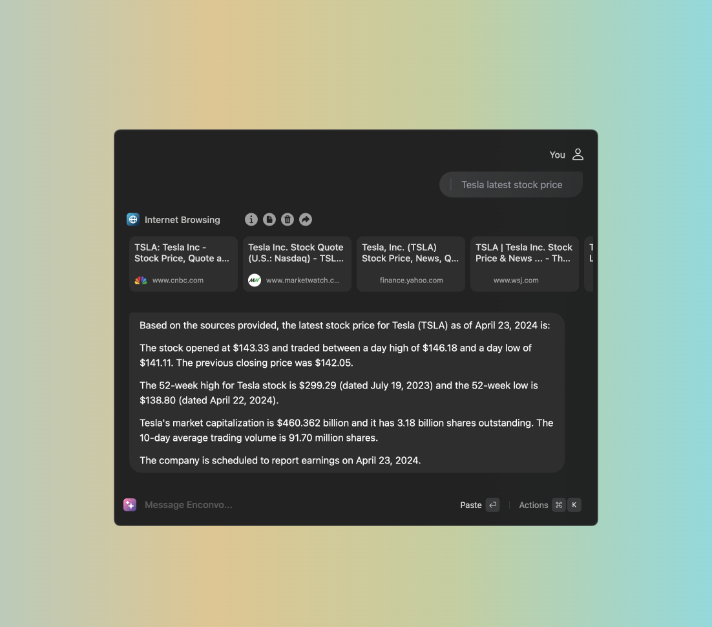

# Internet Browsing

:::note
The browsing function allows you to utilize the intelligence of large models and real-time information from search engines simultaneously, improving search efficiency, automating search and solving problems.
:::


# Internet Browsing Providers

:::tip
The default EnconvoAI Search Provider is powered by google search engine, and is free to use for all users.
:::

Given Enconvo's powerful customization capabilities, users can customize search engines to meet their own needs. Users can customize search engines through the following steps:

```md
Preferences -> Service Providers -> Internet Browsing -> [Select Providers]
```


#### Supported Providers


| Name | Free | Paid | Pricing page | Get API Key |
|---|---|---|---|---|
| [EnconvoAI Search Engine](https://www.enconvo.com) | Free | Free | [Free](https://www.enconvo.com)  | [EnconvoAI](https://www.enconvo.com) |
| [Azure Bing Search Engine](https://www.microsoft.com/en-us/bing/apis/bing-web-search-api) | 1000 queries per month | **S1** $25 per 1,000 transactions | [Pricing](https://www.microsoft.com/en-us/bing/apis/pricing)  | [Get Bing Search Key](https://www.microsoft.com/en-us/bing/apis/bing-web-search-api) |
| [Google Cloud Search Engine](https://programmablesearchengine.google.com/about/) | 100 queries per day | Additional requests cost $5 per 1000 queries, up to 10k queries per day |  | [Get Google Search Key](https://docs.mindmac.app/how-to.../internet-browsing/get-google-search-key) |
| [Tavily](https://tavily.com/) | 1000 queries per month | **Wanderer** plan costs 100$/month for 15000 API calls | [Pricing](https://tavily.com/#pricing) | [Get Tavily Key](https://docs.mindmac.app/how-to.../internet-browsing/get-tavily-key) |
| [Exa](https://exa.ai/) | 1000 queries per month | **Startup** $10/1k searches (1 - 25 results) | [Pricing](https://exa.ai/pricing) | [Get Exa Key](https://docs.exa.ai/reference/getting-started) |
| [You Search](https://api.you.com/) | 1000 queries per month | **Explorer AI** plan costs 100$/month for 14200 API calls | [Pricing](https://api.you.com/plans) | [Get You.com Search Key](https://docs.mindmac.app/how-to.../internet-browsing/get-you.com-search-key) |
| [SerpApi](https://serpapi.com/) | 100 queries per month | **Developer** plan costs 50$/month for 5000 searches | [Pricing](https://serpapi.com/pricing) | [Get SerpApi Key](https://docs.mindmac.app/how-to.../internet-browsing/get-serpapi-key) |