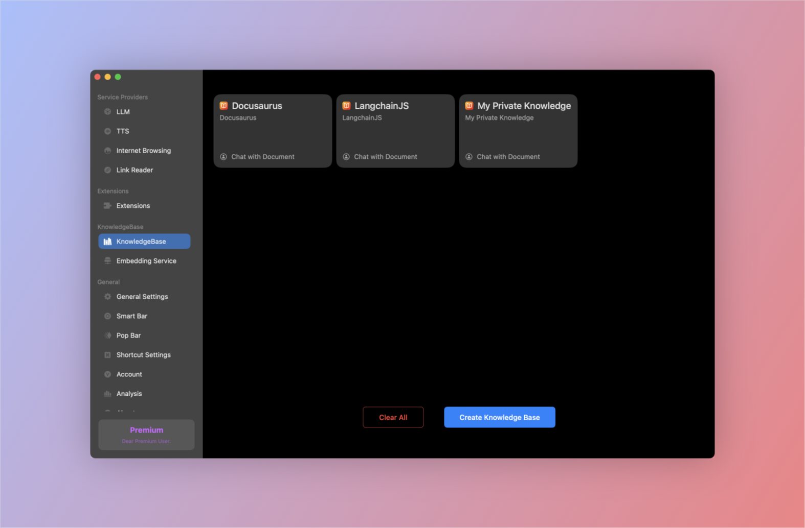
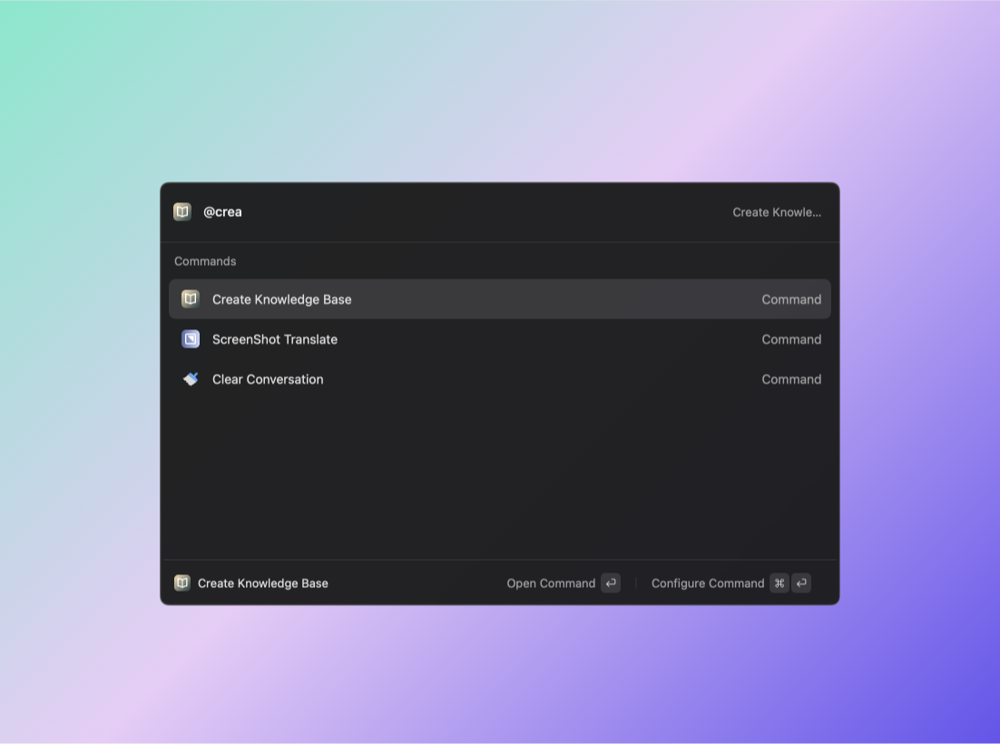

# Knowledge Base

:::note
You can integrate your existing knowledge into Enconvo through the knowledge base function, and engage in dialogue with your knowledge using AI capabilities to form your intelligent brain.
:::

# Create Knowledge Base

#### - Create from documents

:::tip
Supported file types: pdf,doc,xls,ppt,txt,json,md,epub, No size limit
:::

#### - Create Knowledge Base from the whole website content

:::tip
Only support the website with a sitemap.xml file, Or you can upload a sitemap.xml file
:::

#### - Download and install the knowledge base that has been prepared for you from the extension store.
