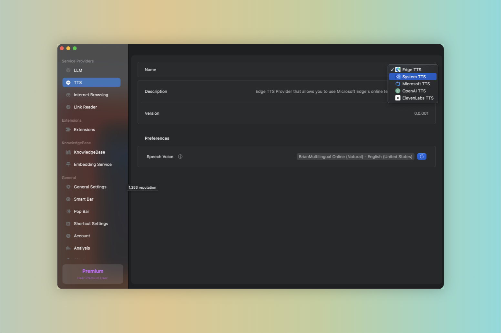

# TTS (Text-to-Speech)

:::note
TTS (Text-to-Speech) is a feature that converts text into spoken voice output. It is a useful tool for people with visual impairments, or for those who prefer to listen rather than read.
:::


# TTS Providers

:::tip
The default TTS provider is powered by `Edge TTS` and is free to use for all users.
:::

Given Enconvo's powerful customization capabilities, users can customize the TTS engine to meet their own needs. Users can customize the engine through the following steps:

```md
Preferences -> Service Providers -> TTS -> [Select Providers]
```




#### Supported Providers

- Edget TTS

- System TTS

- Microsoft Azure TTS

- OpenAI TTS

- ElevenLabs TTS