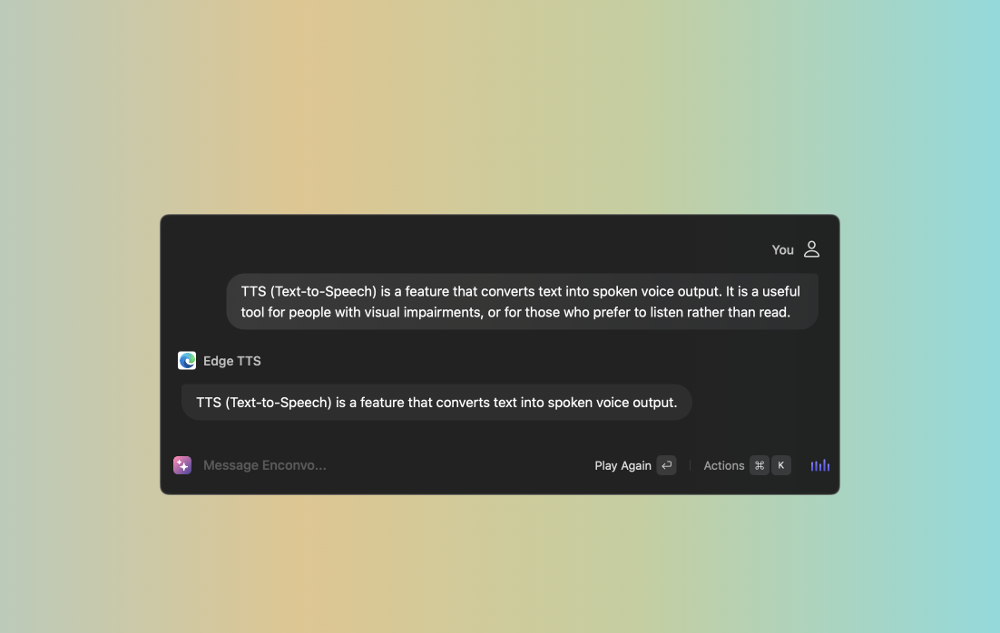
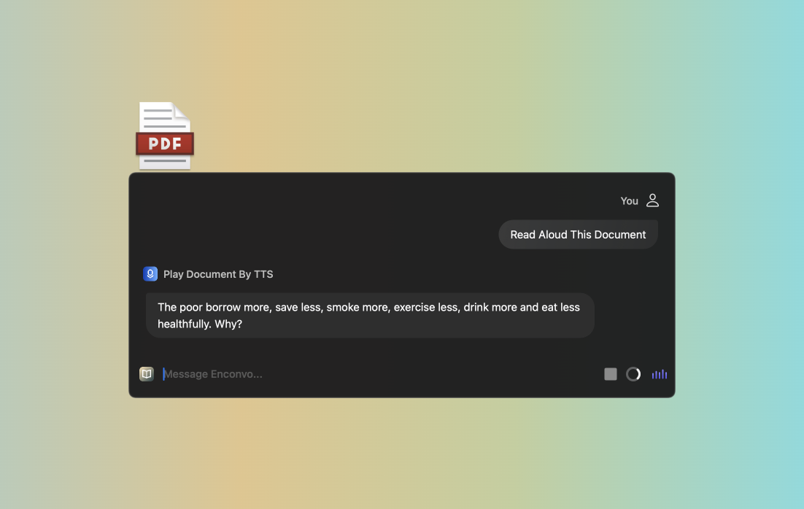
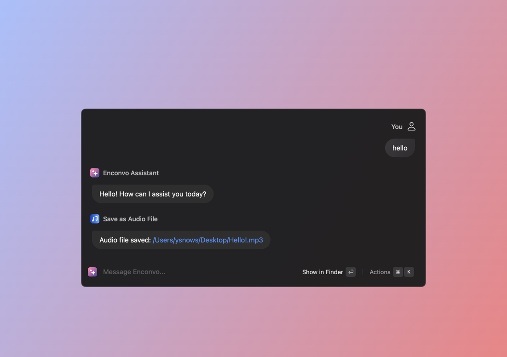

# TTS (Text-to-Speech)

:::note
TTS (Text-to-Speech) is a feature that converts text into spoken voice output. It is a useful tool for people with visual impairments, or for those who prefer to listen rather than read.
:::

## How to use TTS

 
- **Automatically Play TTS Audio** 
:::info
When you enable this feature, the TTS audio will be played automatically when the response is received.
:::

- **Play Text** 
:::info
You input the text you want to convert to speech and `@TTS` to invoke the TTS feature. 
:::

- 

- **Play Document** 
:::info
You can play the text in the document by `@Play Document By TTS`.
:::

- **Save As Audio File** 
:::info
You can save the text to audio file by `@Save As Audio File`.
:::

