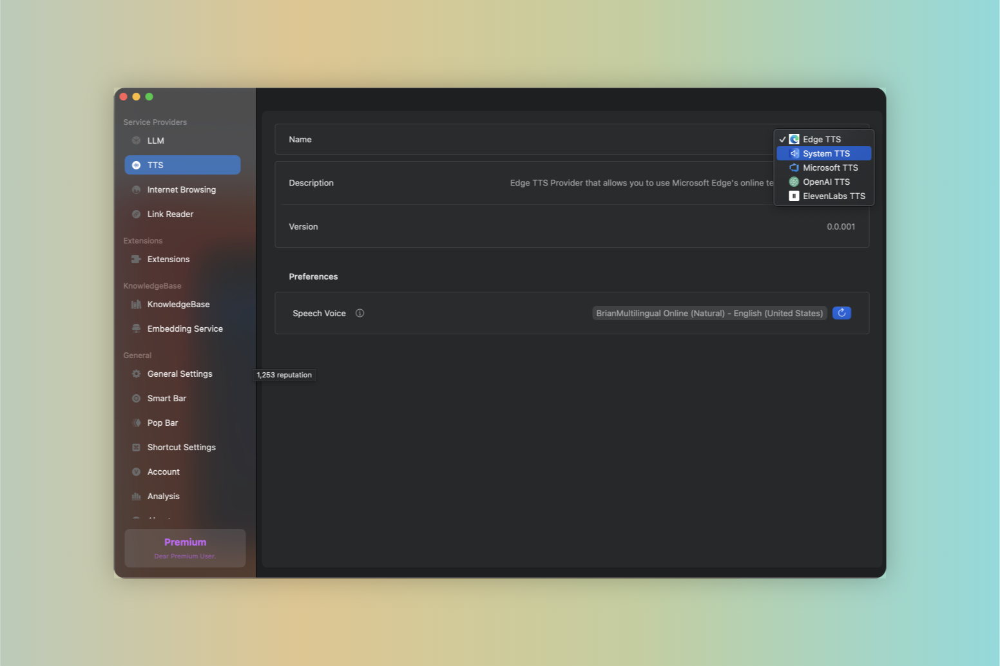

# TTS Providers

:::note
TTS Providers are services that convert text into spoken voice output.
:::

:::tip
The default TTS provider is powered by `Edge TTS` and is free to use for all users.
:::

Given Enconvo's powerful customization capabilities, users can customize the TTS engine to meet their own needs. Users can customize the engine through the following steps:

```md
Preferences -> Service Providers -> TTS -> [Select Providers]
```



#### Supported Providers

- Edget TTS

- System TTS

- Microsoft Azure TTS

- OpenAI TTS

- ElevenLabs TTS
