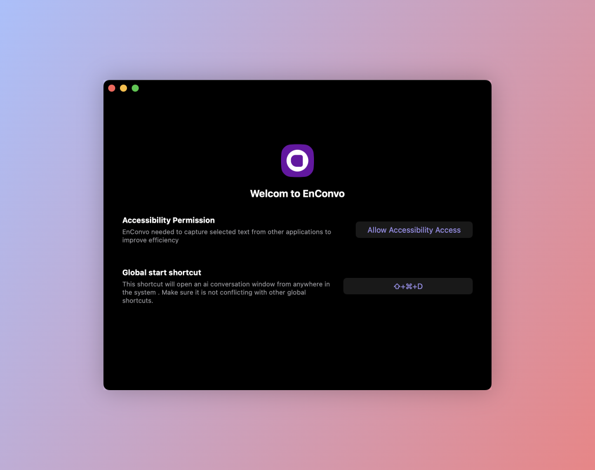

# Getting started

## Getting Started

:::tip 
I will guide you through a few steps to help you quickly use Enconvo.
:::

export const Highlight = ({ children, color }) => (
   {
      // to https://www.enconvo.com
      window.open('https://www.enconvo.com', '_blank');
    }}>
    {children}

  
);

### Download & Install
 

<Highlight color="#1877F2">Click Here To Download</Highlight> 

 

### Start Enconvo

:::note Step 
**Grant Accessibility Permissions & Set Global Shortcut**

You can use the shortcut: Shift + Command + D to open the Smarbar to quickly use Enconvo's features.

:::

:::caution
Enconvo requires Accessibility permissions to enable context-aware capabilities to provide more intelligent AI services. For example, when you are using a browser, Enconvo can obtain the current page's URL and provide more intelligent AI services based on the URL.
:::

### Smart Bar

:::note Step
**Use the Smart Bar to quickly use Enconvo's features From Anywhere**
:::

:::tip 
- You can use signle ` @ ` symbol to select a extension, then press Enter to execute the extension.

- If you use two `@@` symbols, that extension will be used as the default extension.
:::

### Chat Window

:::note 
**Use the Chat Window to manage chat history with all LLMs & extensions**

Open the chat window through the shortcut: Option + Command + D or Menu Bar.

:::

:::tip
The Chat Window can be minimized and placed anywhere on the screen, making it convenient for you to view the chat history at any time during work. 
:::

### All The Other Features

Check out the [features](./category/features--) page to learn more about all the features Enconvo has to offer.