import Youtube from '../components/Video';

# Change Log

 

# Enconvo 2.2.11 Changelog (2025-08-28) 🚀

## New Features

- **ChatGPT Plus/Pro in Enconvo** - Use your ChatGPT Plus/Pro subscription in Enconvo, no need API key anymore. 

## New Models

- **Nano Banana (Gemini 2.5 Flash Image)** - Google DeepMind's Gemini 2.5 Flash model with image generation and editing capabilities, offering state-of-the-art performance in photo-realistic multi-turn edits at exceptional speeds. 

## Optimized Features

- **Image Compression** - Images are now compressed before being sent to models to improve performance and reduce costs.
- **Node Performance Optimization** - Automatically clean up idle workers (workers with no activity for 3 minutes are automatically terminated).
- **Youtube Downloader Update** - Upgraded yt-dlp to version 2025.08.22 for better video downloading support.

## Bug Fixes
 - Fixed incorrect path handling issue in video compression
 - Fixed Terminal.app not syncing issue
 - Fixed AI model global display issue

 

# Enconvo 2.2.10 Changelog (2025-08-19) 🚀

<Youtube src='https://www.youtube.com/embed/179-UULME_g'/>

## New Features

- **Claude Pro/Max in Enconvo** - Use your Claude Pro/Max subscription in Enconvo, no need API key anymore. 

## Optimized Features

- **Thinking Effort** - You can quickly configure the model's deep thinking capability (supports quick switching with Command + E).
- **MCP OAuth** - You can now use MCP services that support OAuth, such as Notion (Official).

## New Free Services

- **Voyage-3.5-lite (embedding)** - You can now use the Voyage-3.5-lite (embedding) model for free. This model has exceptionally powerful multilingual embedding capabilities.

## UI/UX Improvements

- **Custom bots** - Added New Bot button for quickly creating custom bots.
- **Model selection** - Model selection is now displayed in a double-row layout for easier model selection.

## Others
 - Allow uninstallation of some non-essential pre-installed Extensions

 

# Enconvo 2.2.9 Changelog (2025-08-12) 🚀

<Youtube src='https://www.youtube.com/embed/V-xXxb53mkc'/>
<Youtube src='https://www.youtube.com/embed/K_Mmt0eVqRs'/>

## UI/UX Improvements

- **Model Card** - show detailed model information and parameters when hover on the model name.

## Optimized Features

- **Global Model Provider Settings** - Switch the model provider between global settings and custom settings.
- **Add/Edit Model** - You can adjust the model's parameters based on the model's actual attributes and your personal preferences.

## New TTS Models

- **MiniMax Speech 2.5 Model** - Enhanced Multilingual Expressiveness Exceptional Voice

## New MCP Server

- **Excel MCP Server** -  lets you manipulate Excel files without needing Microsoft Excel installed. Create, read, and modify Excel workbooks with your AI agent.

 

# Enconvo 2.2.8 Changelog (2025-08-07) 🚀

<Youtube src='https://www.youtube.com/embed/2zmQ1tl0vsk?start=21'/>

## Brand New Extension Store

- **One-click installation** , Say goodbye to tedious configuration
- **Multiple Registries** - Choose from Enconvo official, Smithery, or mcphub extension sources
- **DXT One-Click Installation** - Quickly install plugins from dxt files.
- **Extension Upgrade** - Independent extension upgrades with one-click functionality
- **Manual Installation** - Support for Stdio/Http/Sse type MCP extensions.

## New AI Models (Limited Time Free, Ending on September 30th)

- OpenAI **gpt-oss-120b** , **gpt-oss-20b**

## Link Reader Providers

> Added local fetch provider: no longer rely on paid network services such as firecrawl/jina

- **Local Fetch** - (locally,free)
- **Crawl4AI** - (locally, free)

## Website Crawler Providers

> Added local website crawler provider: no longer rely on paid network services such as firecrawl

- **Crawl4AI** - (locally, free)

## New Features

- **Points Usage Log** - Added points usage log page （Settings->Account->Points Usage）

## Optimized Features

- **MCP Server Auto-shutdown** - MCP servers automatically shut down after 3 minutes of inactivity

 

# Enconvo 2.2.7 Changelog (2025-07-22) 🚀

## Added Speech Recognition Model `mlx parakeet-tdt-0.6b-v2`

- **Speech-to-Text Provider** - Added `mlx-community/parakeet-tdt-0.6b-v2` support, faster speed and better quality, local & privacy-focused (first use may be slower as it needs to download the model)

## New AI Model Provider

- **302.ai** - Added [302.ai](http://302.ai) LLM provider

## Optimized Features

- **App Size Optimization** - Reduced application size from 367MB to 224MB
- **Moonshot BaseURL Support** - Added support for custom BaseURL settings: [`https://api.moonshot.ai/v1`] or `https://api.moonshot.cn/v1`

## Bug Fixes

- Fixed Online Video Downloader `audio only` option, resolved convert to mp4 long processing time issue, and fixed missing mp4 suffix problem
- Fixed MCP runtime error issues
- Fixed Summarize YouTube/Link response language setting not taking effect
- Resolved [fireworks.ai](http://fireworks.ai) error issues

 

# Enconvo 2.2.6 Changelog (2025-07-18) 🚀

## Knowledge Base

- **Enhanced Knowledge Base UI/UX** - Streamlined interface for easier creation, editing, and deletion of knowledge bases
- **YouTube Video Import** - Import videos with automatic subtitle extraction
- **Image Import with OCR** - Extract and index text content from images automatically
- **Audio File Import** - Convert speech to text and add to knowledge base
- **Video File Import** - Extract audio and convert speech to searchable text
- **Single Web Page Import** - Extract content from any webpage using Jina or Firecrawl
- **Whole Website Import** - Crawl and import entire websites using Firecrawl
- **Direct Text Addition** - Quickly add custom text content to your knowledge base

## New AI Models

- **Grok 4** - Added support for Grok 4, including Enconvo Cloud Plan and using your own API key
- **Kimi K2** - Added support for Kimi K2, including Enconvo Cloud Plan and using your own API key (moonshot)

## TTS

- **TTS Voice Preview** - Support for previewing TTS Voice sounds

## New Features

- **Firecrawl** - Added Firecrawl as `Link Reader Provider`
- **Website Crawl** - Added `Website Crawl provider` support
- **Translator (Interactive)** - Added `Translator (Interactive)`

## Optimized Features

- **Summarize Url / Chat with Url** - Optimized continuation conversation logic for Summarize URL / Chat with URL
- **YouTube Video Download** - Optimized YouTube video download and subtitle download logic for better stability
- **Chat with Youtube** - Optimized `Chat with Youtube` logic and improved `Summarize Youtube` prompt
- **ElevenLabs V3** - Support for ElevenLabs V3 (V3 API not yet released, but model list retrieval has been switched to dynamic fetching)

## Bug Fixes

- Fixed copy/paste compatibility for Ukrainian language, with keyboard simulation fallback for copy/paste operations
- Fixed video playback issues for downloaded videos, default download quality set to best

 

# Enconvo 2.2.5 Changelog (2025-06-23) 🚀

## Mini SmartBar

- Mini SmartBar now supports custom commands, allowing users to freely add commands that suit their needs, with support for Application Awareness and Browser Tab URL Awareness

## Dictation

- Added Dictation `Post Actions` feature, allowing users to configure actions to execute after Dictation ends, such as `Fix Spelling` or `Translate` or `customized workflow`
- Renamed `Voice Input` to `Dictation`

## Prompt Management

- Added `Prompt Store`, allowing users to install curated prompts
- Added `Installed Prompt` management, allowing users to manage their installed and created prompts
- Added `Create new prompt` command, allowing users to create their own prompts

## SmartBar

- Added `SmartBar Navigation bindings`, users can configure navigation using Control+P and Control+N or vim-like Control+J/Control+K
- Added `SmartBar Auto clear conversation`, allowing users to configure automatic conversation clearing time

## New Commands

- `French Teacher`: A French teacher to help users learn French

## Optimized Features

- `Disable command` feature: you can disable commands you don't need, disabled commands won't appear in SmartBar
- `PopBar` now supports detecting current browser tab URL to display different toolbars accordingly
- `Shortcut` settings UI/UX optimization

## Bug Fixes

- Fixed issue where Dictation Bar couldn't be closed
- Fixed issue where PopBar window position exceeded screen boundaries
- Fixed issue where Shortcut settings would invalidate existing shortcuts
- Fixed issues with Post Action not working in PopBar and auto replace not functioning
 

# Enconvo 2.2.4 Changelog (2025-06-21) 🚀

## PopBar (Big Update)

- **Application-Awareness**: PopBar can now detect the current application and display different toolbars accordingly, making PopBar show tools more suitable for the current application's context, improving efficiency
- Built-in `Writing Tools` PopBar Instance that appears when in writing apps (Notes.app, Notions.app, Obsidian.app, etc.), showing writing-related tools
- Added option to automatically replace current text after tool returns result
- Optimized PopBar appearance timing to avoid unnecessary appearances
- Optimized PopBar position to appear in more appropriate locations, enhancing user experience
- Added `Open Link` tool that displays when selected text contains links, clicking opens the link in default browser
- Added `Search Google` tool to perform Google search on selected text
- Added `PopBar disable in this application` feature to quickly disable PopBar in current application
- Added `Duplicate of PopBar Instance` feature to quickly copy current PopBar Instance
- Added `Modifier flags action` feature to set actions when clicking PopBar while holding option/shift/command modifiers, enabling auto-copy results to clipboard or replace selected text with tool execution results

## New Commands

- Added more writing tools: `proofread`, `rewrite`, `changeToneToProfessional`, `makeConcise`, `extractKeyPoints`, `convertToList`, `convertToTable`
- Added `AI Editor` command to edit current text according to user instructions, similar to Cursor.app's `Quick Edit` feature but can be used in any application

## New Extension (Fal.ai)

- Added generate video with Veo3
- Fal.ai text-to-video with Minimax Hailuo02 Standard
- Fal.ai text-to-video with Minimax Hailuo02 Pro
- Fal.ai generate video with Bytedance Seedance 1.0 Lite

## Optimized Features

- Added custom bots management in settings for centralized management of user-created bots
- Adjusted Mini SmartBar expansion timing to improve user experience
- Added `PopBar` toggle in menu bar
- Added `MiniSmartBar` toggle in menu bar
- Added `delete command` and `reset configuration` features in settings page
- Optimized Command search UI/UX for easier command search and addition

## Enconvo Cloud Plan New Models

- Claude Sonnet 4
- Opus 4
- O3
- O3 Mini
- O4-Mini
- Gemini 2.5 Pro
- Gemini 2.5 Flash
- Gemini 2.5 Flash Lite Preview

## Workflow

- Added `Generate Video with Veo3` workflow template
- Added `Text to Audio` workflow template

 

# Enconvo 2.2.3 Changelog (2025-06-15) 🚀

## New Features

- Configurable option for whether new chats created in Chat window will be displayed in Smartbar

## Optimized Features

- Optimized `Installed Extensions` management page
- Optimized `Explain` prompt
- Optimized PopBar settings page UI/UX
- New settings UI/UX (Smartbar, MiniSmartbar, ChatWindow, Langchain, Developer Tools)

## Bug Fixes

- Fixed `Create New bot` editing issue
- Fixed `Google Cloud Search` errors
- Fixed `After changing the chatbot name, it still uses the old name` issue
- Fixed issue where model list sometimes fails to refresh

 

# Enconvo 2.2.2 Changelog (2025-06-11) 🚀

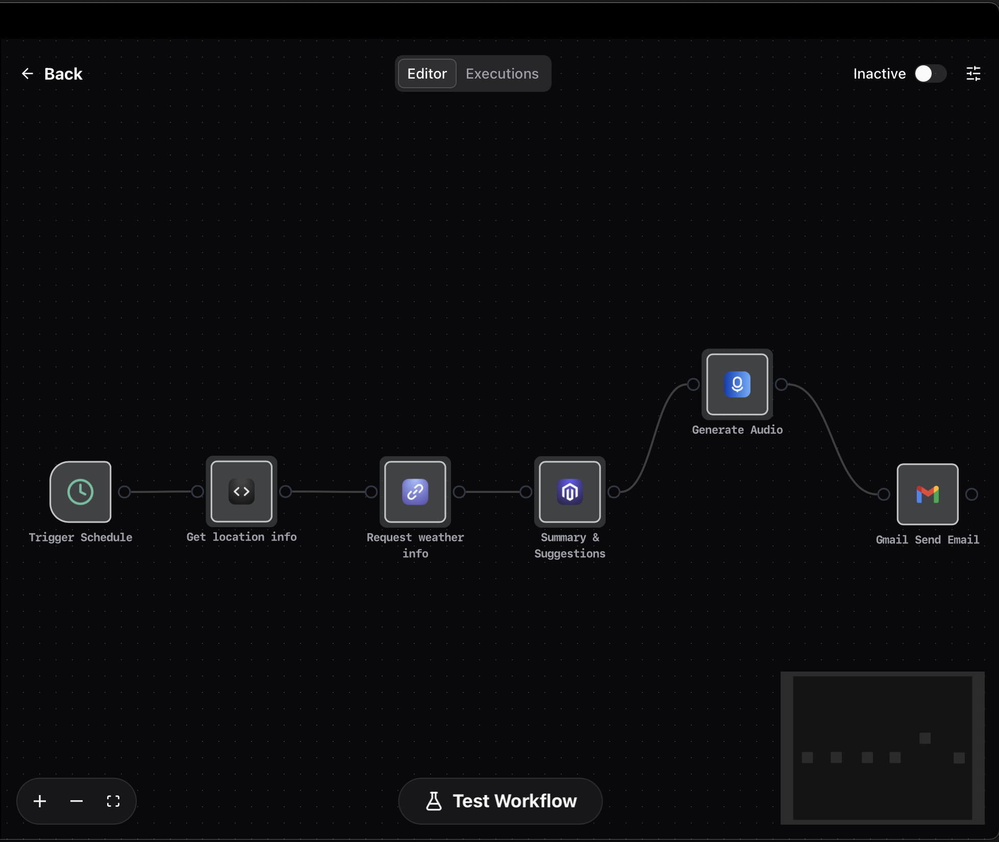

## New Features

- Added scheduled trigger functionality for Workflows, allowing you to set timer trigger with support for cron expressions
  > Pre-built workflow template for getting weather information at 7 AM every day, generating TTS voice broadcast, and sending email to specified mailbox, available for installation in the Workflow Store

## Optimized Features

- Workflow/Agent supports Gmail attachment sending
- Ability to rename nodes in Workflows and set meaningful node names
- Optimized auto-scroll issue when outputting text in chat

## Fixed Issues

- Straico AI issues fix
- Fixed issue where Shortcuts Center doesn't display shortcuts
- Fixed Google Gemini error issues
- Fixed clipboard-related crash issues

 

# Enconvo 2.2.1 Changelog (2025-06-07) 🚀

 

## Workflow - Build your AI automation workflow using built-in tools and numerous MCP Servers

- Brand new **visual workflow editor**, clearer, more intuitive and faster workflow construction
- Built-in 200+ tools, **native support for using MCP Servers in workflows**, making workflow extensibility endless
- **Smart parameters support**, can automatically generate tool parameters based on workflow context through AI
- New **Workflow Templates Store**, users can quickly install templates with built-in default templates
- Workflow parameter settings support **jinja2** template syntax, making workflow parameter configuration more flexible

## Brand new Credentials Management

- Optimized Credentials management logic, making Credentials management more convenient
- Support for **OAuth 2.0** authentication
- Added more Provider Credentials management

## New Plugins

- New **Gmail** , supports OAuth2 authorization login, supports sending emails, reading emails and other tools
- New **Firecrawl**  (including Enconvo Cloud support), supports web scraping, website crawling and other tools
- New **Gemini TTS**, **Gemini TTS Multi Speaker**  (including Enconvo Cloud support), supports multi-person conversation TTS generation

## MCP Feature Improvements

- MCP can now **individually configure** whether to enable specific tools
- MCP is now bound to Agent, no longer globally applied to all Agents
- MCP management add/delete UI/UX improvements

## Context Awareness Feature Improvements

- Support for more Context awareness, such as current screen screenshots, current application screenshots, clipboard text, etc.
- Users can freely configure the context that each Command can perceive

## Feature Improvements

- Fix Spelling&Grammar supports **text highlight comparison** functionality for modifications
- Stability and performance optimizations
- Settings page UI/UX improvements
- Chat Window new session creation UI/UX improvements
- Mini smartbar automatically shrinks and hides after 1s of no operation
- Mini smartbar automatically snaps to edges
- `Create New Bot` UI/UX improvements

 

# Enconvo 2.1.9 Changelog (2025-05-02) 🚀

 

## Improvements 🎉

- **Language Settings for Chat Responses** - Now you can configure the language your agent responds in
  
- **Toggle for Mini Window** - Easily enable or disable the Mini Window feature based on your preference

- **Enhanced Voice Dictation Stability** - More reliable speech recognition  

 

# Enconvo 2.1.8 Changelog (2025-04-22) 🚀

 

## New Features 🎉

- **Introduced Mini SmartBar** - A compact desktop companion

  > A persistent mini version of SmartBar that offers:
  >
  > - Quick access to features (Speak, Live Screen, etc.)
  > - Real-time status display

- **Integrated Hailuo Voice** as default TTS Provider (Enconvo Cloud Plan)

- **New OCR Providers**

  > - Apple Native OCR: Fast, offline, privacy-focused local processing
  > - Mistral OCR: Integrated solution supporting both Enconvo Cloud Plan and custom Mistral API Keys

- **Added new Mistral models** to Enconvo Cloud Plan

  > - Mistral Large (300 points per message)
  > - Mistral Pixtral Large (300 points per message)
  > - Mistral Codestral (45 points per message)
  > - Mistral Small (Free)
  > - Mistral Pixtral 12B 2409 (Free)
  > - Mistral Nemo (Free)

- **Introduced Enconvo Cloud Plan** for Speech-to-Text Provider

  > - Supporting whisper turbo, gpt-4o-transcribe, and gpt-4o-mini-transcribe

## Improvements 🔧

- **Startup optimization** and bug fixes for improved launch reliability
- Enhanced Image Generation with **Flux1.1 pro** (Enconvo Cloud Plan)
- Added close button to Voice Input Method
- Added direct model configuration in Chat Window

- Expanded **Google Gemini model support**
  > - Added `gemini-2.0-flash-exp-image-generation` for in-chat image generation
  > - Added `gemini-2.5-flash-preview-04-17` model

> - OCR Improved: Automatic language detection with **Japanese** support

- Optimized audio auto play logic and fixed playback issues

- Enhanced Speech-to-Text stability

 

# Enconvo 2.1.7 Changelog (2025-04-07) 🚀

 

## New Features 🎉

- Introduced MCP Store - Your One-Stop Shop for MCP Servers
  > A curated collection of popular MCP Servers with convenient features:
  > - One-click installation for quick and easy setup
  > - Online access at https://app.enconvo.ai/mcp_store
  > - Share your favorite MCP Servers with friends via shareable links

- Added dedicated MCP configuration toggle in SmartBar for streamlined control

- Integrated support for gemini-2.5-pro-preview-03-25
  > Now available with Enconvo Cloud Plan

- Introduced Command + S shortcut to toggle AI search

 

# Enconvo 2.1.6 Changelog (2025-03-25) 🚀

 

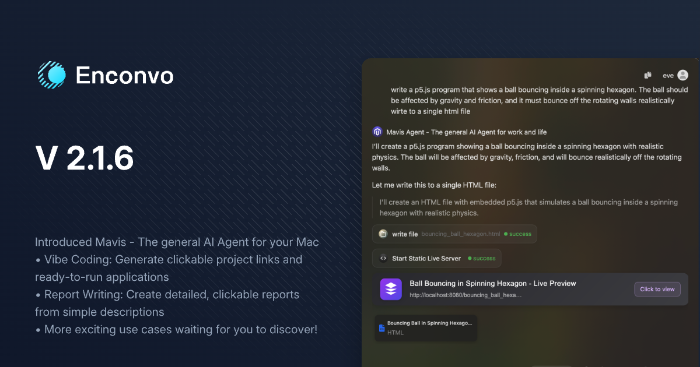

## New Features 🎉

- Introduced Mavis - The general AI Agent for your Mac
  > A versatile AI assistant that enhances your daily workflow:
  > - Vibe Coding: Generate clickable project links and ready-to-run applications on your Mac with a single prompt
  > - Report Writing: Create detailed, clickable reports from simple descriptions
  > - More exciting use cases coming soon... waiting for you to discover!

- Added multi-language UI support (German, French, Japanese, Spanish), especially for settings pages

- Introduced `Text to Sound Effect` feature
  > Transform text into various sound effects powered by ElevenLabs
  > Supports using Enconvo Cloud Plan points 

## Improvements 🔧

- Rewrote message list for enhanced loading and scrolling performance
- Added resolution settings for Online Video downloads
- Enhanced video downloader with browser cookie support for private content (e.g., Facebook videos from private groups)
- Improved knowledge base addition speed and stability

 

# Enconvo 2.1.5 Changelog (2025-03-05) 🚀

 

## New Features 🎉

- Added support for new Perplexity models: `r1-1776` and `sonar-deep-research`

- Added configurable result count for AI Web Search

- Added ability to hide Chat Window using the `ESC` key

- Added voice playback functionality for existing responses

- Added Elevenlabs Scribe speech-to-text integration

- Added Elevenlabs TTS integration

- Added Speechify TTS integration

## Improvements 🔧

- Optimized Live Captions with customizable caption height
- Enhanced stability when adding large files to knowledge base

## Bug Fixes 🐛

- Fixed longPress shortcut key issue with `Voice input method push`

 

# Enconvo 2.1.4 Changelog (2025-03-01) 🚀
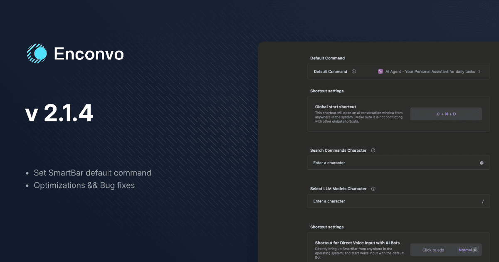

 

## New Features 🎉

- Added SmartBar default command setting functionality
  > Allows users to configure preferred commands for SmartBar
- Added `reasoning_effort` parameter for LLM
  > Enables adjustment of model reasoning depth for more control over AI responses

## Improvements 🔧

- Optimized PopBar hotkey logic to toggle display/hide mode
  > Improved user experience with more intuitive keyboard shortcut behavior
- Enhanced SmartBar UX logic
  > Better user interaction flow and responsiveness

## Bug Fixes 🐛

- Fixed issue where "New Chat" in Chat Window couldn't use web browsing functionality
  > Restored proper web access capabilities in new chat sessions
- Fixed problem with SmartBar hotkey deletion not working
  > Ensured reliable hotkey removal when needed

 

# Enconvo 2.1.3 Changelog (2025-02-25) 🚀
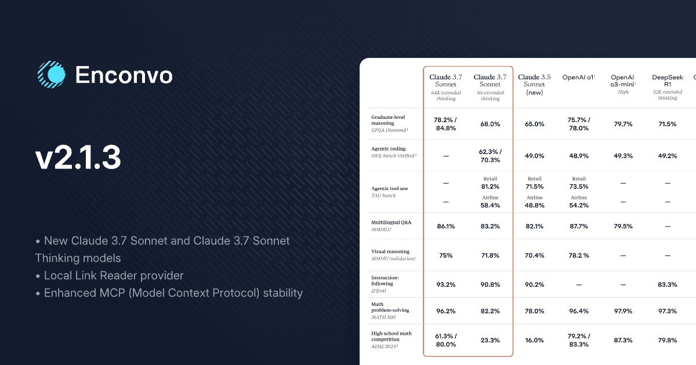
 

## New Features 🎉

- Added support for the new `Claude 3.7 Sonnet` and `Claude 3.7 Sonnet Thinking` models
- New `Local Link Reader` provider for faster, more stable, and higher quality webpage content extraction
  > Free and unlimited access to fetch web content without API Keys.
- New `Read Aloud Webpage` Tool for reading aloud the content of a webpage

## Improvements 🔧

- Optimized prompts to improve agent instruction following capabilities
- Enhanced MCP (Model Context Protocol) stability for more reliable tool execution

 

# Enconvo 2.1.2 Changelog (2025-02-22) 🚀
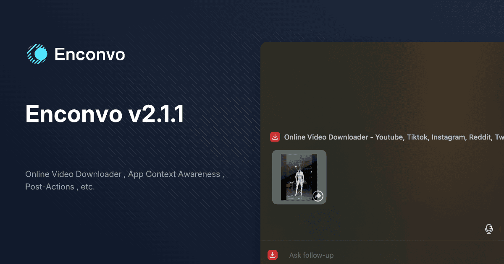
 

## New Features 🎉
- New `Online Video Downloader` tool, supporting platforms (TikTok, YouTube, Twitter, Instagram, Reddit, Vimeo, Pornhub, XVideos, etc.)
> You can download videos via EnConvo by simply Ctrl+D on the webpage.
- New `App Context Awareness` feature to use current app content and screenshots as context
- New `post-action` settings , which can be executed after command execution, supporting `paste`, `insert` and `copy`
- New `PopBar` display style settings to show/hide icons and text

## Improvements 🔧

- Enhanced AI Web Search functionality by adding source references to output results
- Improved Chat Window's `new chat` and `clear conversations` logic for better usability
- Upgraded Speech-to-text Deepgram Provider with `Nova 3` model support
- Optimized `DeepSeek R1` model speed and stability
- Added support for custom Google Gemini LLM Provider BaseUrl
- Added support for custom DeepSeek LLM Provider BaseUrl

## Bug Fixes 🐛

- Fixed auto duplicate issue when using SmartBar in Preview.app
- Fixed text input issues with Voice Input Method when using Local Whisper and Stream Insert
- Fixed Claude image format compatibility issues
- Fixed Insert Below compatibility issues
- Fixed model display not updating in top-right corner after switching models with "/"

 

# Enconvo 2.1.0 Changelog (2025-02-13) 🚀

 

## New Events 🎉
- DeepSeek R1 and DeepSeek V3 are now available for unlimited free use (2025-02-13 ~ 2025-03-13)

## Improvements 🔧

- Optimized default configuration settings logic

## Bug Fixes 🐛

- Fixed shortcut key settings not taking effect
- Fixed issue where models could not be selected via mouse click

 

# Enconvo 2.0.9 Changelog (2025-02-11) 🚀

 

## New Features 🎉

- Added model switching with / character
- Added Context deletion features
  - Delete: Remove single Context
  - Shift + Delete: Remove single Context but keep input text
  - Shift + Cmd + Delete: Remove all Contexts
- Deep Research Agent now shows research process
- Added custom shortcut keys support for @ (search commands) and / (search LLM models) trigger characters

 

## Improvements 🔧

- Improved startup stability
- Enhanced Context display
- Improved copy/paste compatibility

 

# Enconvo 2.0.8 Changelog (2025-02-10) 🚀

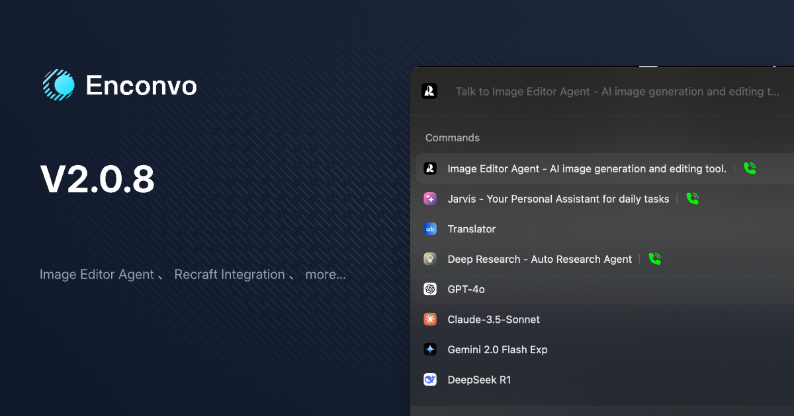

 

## New Features 🎉

- Added Recraft integration for enhanced design workflows
- Added Image Editor Agent for advanced image manipulation
- Added New Chat functionality
- Added Duplicate Command functionality
  - Recraft - Crisp Upscale
  - Recraft - Generate Image
  - Recraft - Image to Image
  - Recraft - Vectorize Image
  - Recraft - Creative Upscale
  - Recraft - Remove Background
  - Recraft - Replace Background

 

## Bug Fixes 🔧

- Fixed Exa Websearch Provider issues
- Fixed incorrect tab detection in Safari

 

# Enconvo 2.0.7 Changelog (2025-02-07) 🚀

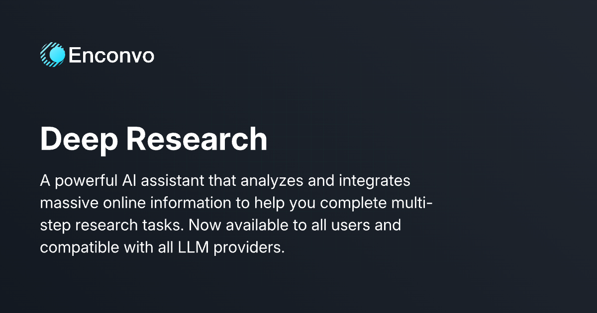

 

## New Features 🎉

- Added Deep Research Agent

 

## Feature Updates 🔄

- Changed default LLM model to gpt-4o

 

## Bug Fixes 🔧

- Fixed background crash issues
- Added multi-screen centered display support for Smart Bar

 
# Enconvo 2.0.6 Changelog (2025-02-06) 🚀

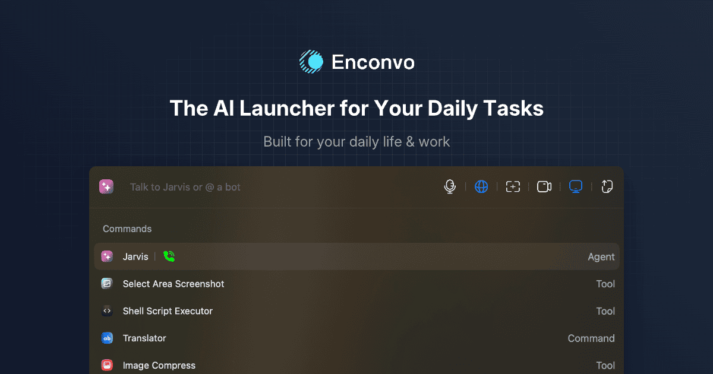

 

## Google Gemini Updates 🤖

- Updated Gemini 2.0 Flash to stable release
- Added gemini-2.0-flash-lite model
- Added gemini-2.0-pro-exp model

 

## Subscription Management 💳

- Added subscription cancellation management interface for subscription plan

 

## Bug Fixes 🔧

- Fixed Hailuo TTS (Chinese) related issues
- Fixed missing text issue when activating PopBar with hotkey
- Fixed Double Click hotkey configuration issue
- Fixed Voice Input Method unable to stop when connection is lost

 

# EnConvo 2.0.5 Changelog (2025-02-03) 🚀

 

## Video Downloaders 📥

- *Twitter Video Downloader*: Added support for downloading Twitter videos
- *YouTube Video Downloader*: Added support for downloading YouTube videos

 

## Apple Extensions Enhancements 🍎

### Apple Reminders
- Added new commands:
  - Update reminders
  - Delete reminders 
  - Toggle reminder status
  - Get all incomplete reminders

### Apple Calendar
- Added new commands:
  - Delete events
  - Update events
  - Get calendar events list

### New Apple Mail Extension
- View unread emails
- Delete emails
- Toggle read/unread status
- View email content
- Send emails

 

## Screenshot Extension Updates 📸
- Added new capture commands:
  - Capture current application
  - Capture current screen
  - Manual window selection capture

 

## AI Model Improvements 🧠

- Optimized thinking process display for Ollama R1 and other reasoning models
- Added DeepSeek R1 and DeepSeek V3 model support to Enconvo Cloud Plan
- Enhanced Jarvis prompt for improved Agent task execution capabilities
- Updated Perplexity models: `sonar`, `sonar-pro`, `sonar-reasoning`

 

## Other Updates 🔄

- *Conch TTS*: Split into chinese and international servers
- *LM Studio*: Added model list display
- Fixed straico-related issues

 
 

# EnConvo 2.0.4 Changelog (2025-01-24) 🚀

 

## Agent Features 🤖

- Jarvis: Jarvis can now automatically complete tasks using tools based on your needs. Default available tools include:

  - Code Execution:
    - AppleScript: Execute AppleScript automation tasks
    - Shell: Run Shell commands and scripts  
    - Python: Execute Python code and scripts
    - NodeJS: Run NodeJS code
  - Image Generation: AI-assisted image creation
  - Apple Calendar: Manage and create calendar events
  - Apple Reminders: Set up and manage reminders
  - Image Compression: Optimize image size and quality
  - HTTP Requests: Send various network requests
  - Text-to-Speech: Convert text to speech
  - TTS: Text-to-speech conversion
  - Audio/Video Transcription: Convert audio and video to text
  - Video Compression: Optimize video file size
  - Web Search: Search internet information
  - Link Reader: Quick reading and summarizing webpage content
  - YouTube Loader: Download and process YouTube video content
  - File System Operations: File and directory management

- Added "Create New Agent" feature to create new agents, specify prompts, and configure tools
- Agent functionality requires models that support Tool Use, Claude 3.5 Sonnet model recommended

 

## MCP (Model Context Protocol) Support 🔌

- EnConvo as MCP Client supports installation and use of any MCP Server, with direct server calls in Agents and Workflows
- MCP Settings page features:
  - Real-time server status monitoring
  - Server configuration modification (changes apply automatically)

 

## DeepSeek r1 Model Support 🧠

- Added support for DeepSeek r1 model
- Added Thinking interaction mode to display model thought process in real-time

 

## New Video Utils Plugin 🎥

- *Video Compress*: Added video file compression functionality
- *Extract Audio*: Added audio extraction from video

 

## New Audio Utils Plugin 🎵

- *Audio Compress*: Added audio file compression functionality

 

## New Transcription Plugin 📝

- *Transcribe Audio/Video Files*: Added transcription support for audio/video files

 

## Code Runner Plugin Enhancements 💻

- *Python Code Runner*: Added Python Code Runner support
- *NodeJS Code Runner*: Added NodeJS Code Runner support
- *Shell Script Executor*: Added Shell Script Executor support
- *AppleScript Executor*: Added AppleScript Executor support

 

## Conch TTS Support 🐚

- Added support for Conch TTS

 

## Google LLM Provider Updates 🔄

- Updated to latest gemini-2.0-flash-thinking-exp-01-21
- Native support for audio message types

 

## Optimizations ⚡

- Improved TTS performance
- Optimized Python environment initialization
- Added parameter display in Workflows
- Other general improvements

# EnConvo 2.0.3 Changelog (2024-12-20) 🚀

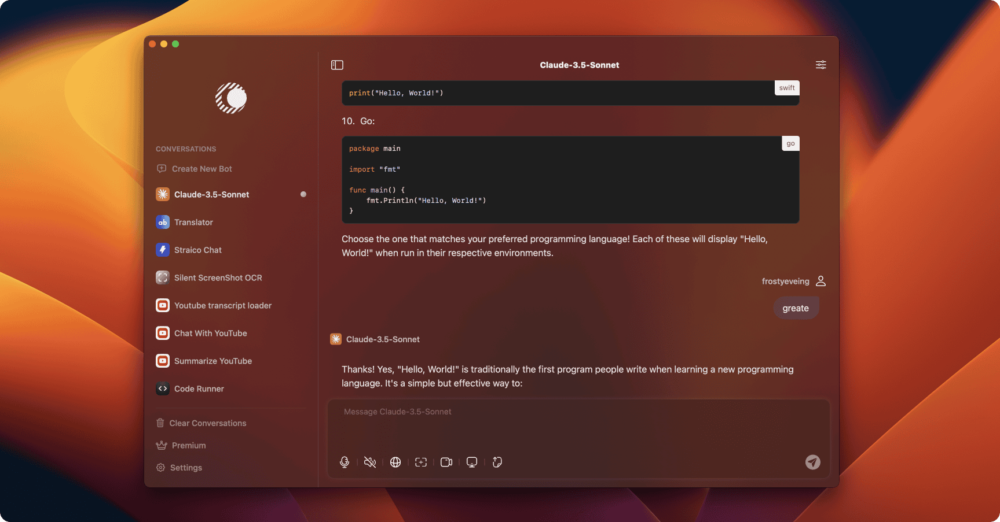

 

## Chat Window Enhancements 💬

- New UI design for improved aesthetics
- Performance optimization with reduced CPU usage
- Expanded functionality: Integrated Voice Input, Screenshot, Web Search, Live Screen, Live Camera, File Attachment, and Realtime Call features directly within the Chat Window

 

## YouTube Plugin Integration 🎥

- Chat With YouTube: Engage in conversations about YouTube video content
- Summarize YouTube: Generate concise summaries of YouTube videos
- YouTube Transcript Loader: Extract video subtitles , or save as SRT or TXT files
- YouTube Context Awareness: Smart recommendation of relevant commands based on currently open YouTube videos in the browser
- Source Code : https://github.com/Enconvo/YouTube

 

## Code Runner Plugin 💻

- You can run shell, Node.js, Python, and AppleScript code
- Empowers users to extend EnConvo's capabilities using their preferred programming languages
- Source Code： https://github.com/Enconvo/Code-Runner

 

## Straico Integration 🔗

- Straico LLM Provider: Leverage Straico's LLM services to power EnConvo functionalities
- Straico Image Generate Provider: Utilize Straico's image generation services to generate images
- Straico Plugin:
  - Straico Chat: Interact with Straico-provided models
  - Create Straico RAG: Create new Straico RAG (Retrieval-Augmented Generation)
  - Straico RAG: Chat with RAG systems created on the Straico platform
  - Straico Agent: Communicate with agents created on the Straico platform
- Source Code： https://github.com/Enconvo/straico

 

## Google Gemini Update 🧠

Added support for new models:

- `gemini-2.0-flash-exp`
- `gemini-2.0-flash-thinking-exp-1219`
- `gemini-exp-1206`

 

## X.AI-GROK Update 🤖

Introduced support for the latest models:

- `grok-2-vision-1212`
- `grok-2-1212`

 

## New Setting Option ⚙️

- Added "Context Message Count Limit" to control the length of contextual messages

### EnConvo 2.0.2 Changelog (2024-12-12) 🚀

 

#### Performance Improvements 🚀

 

##### Voice Input Efficiency: 🎤
> CPU usage reduced from 40% to 5%

##### SmartBar Optimization: ⚡️
> CPU usage reduced from 1.9% to 0.2%

##### Live Screen Preview Enhancement: 🖥
> CPU usage reduced from 30% to 12%

#### New Features ✨

 

##### Ollama Embedding Integration: 🔄
> Chat with Document and Knowledge Base features now work completely offline

##### Audio Input Selection: 🎙
> Voice Input Method now supports custom audio source selection

#### Improvements 🔧

 

##### UI Enhancements: 🎯
> - Fixed "Untitled" display issue in Extensions list
> - Resolved text styling in SmartBar by removing formatting on paste
> - Fixed pinyin input display issue in SmartBar [github issues]( https://github.com/ysnows/enconvo/issues/5)

##### Voice and TTS Improvements: 🗣
> - Fixed TTS speed settings not taking effect
> - Resolved incomplete voice recognition when closing Voice Input Method

#### Integrations 🔌

 

##### Google TTS Support: 🔊
> Get your API Key at [Google Cloud Console](https://console.cloud.google.com/apis/credentials)

### EnConvo 2.0.1 Changelog (2024-11-27) 🚀

 

####  New Features ✨

 

##### Deeplink Support: 🔗

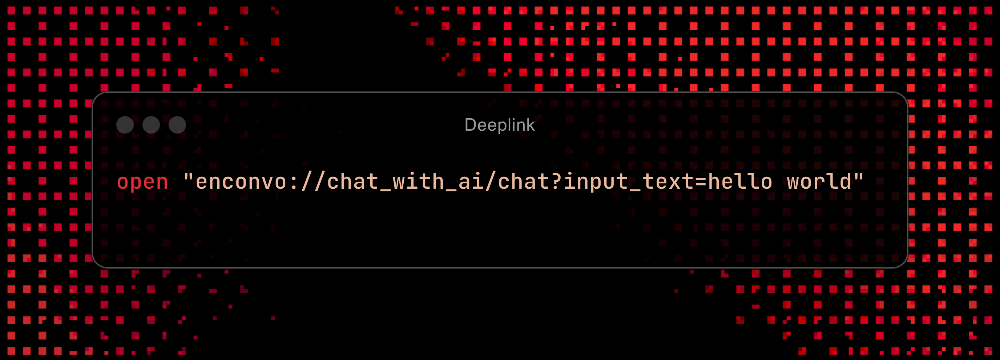
> Generate deeplink for command in SmartBar for quick access within the system. For example: `open "enconvo://chat_with_ai/chat?input_text=hello world"` or directly open in browser with `enconvo://chat_with_ai/chat?input_text=hello world`

##### Markdown-to-Image Extension: 📸

> Convert Markdown content into beautiful images quickly and easily

##### [EnConvo Companion](https://chromewebstore.google.com/detail/enconvo-companion/afaklbihknigbnjdkegbnenkheogejkd) Chrome Extension: 🌐

> Directly capture and access current browser content

##### ChatGPT Website Integration: 🤖

> Quick access to [ChatGPT](https://chatgpt.com) directly from SmartBar

##### ChatGPT Website With Search Integration: 🔍

> Quick access to [ChatGPT](https://chatgpt.com) directly from SmartBar with search function

##### Claude Website Integration: 🧠
> Launch [Claude](https://claude.ai/chats) instantly from SmartBar

####  Improvements 🔧

 

##### Context Awareness: 🎯
> - Added ARC browser support

##### Voice Input Method Enhancements: 🎤
> - Stream Insert mode toggle for real-time input display (disabled by default)
> - Added 2-second pause detection for automatic line breaks between sentences

##### Other Improvements: ⚙️
> - Reduced number of default keyboard shortcuts
> - Added Slovak language support
> - New extension removal feature accessible via SmartBar

####  Bug Fixes 🐛

 

> - Fixed issue where current workflow could be selected during workflow creation
> - Resolved "Untitled" workflow display problem in PopBar

 
 

## EnConvo 1.9.17更新日志 (2024-11-20)

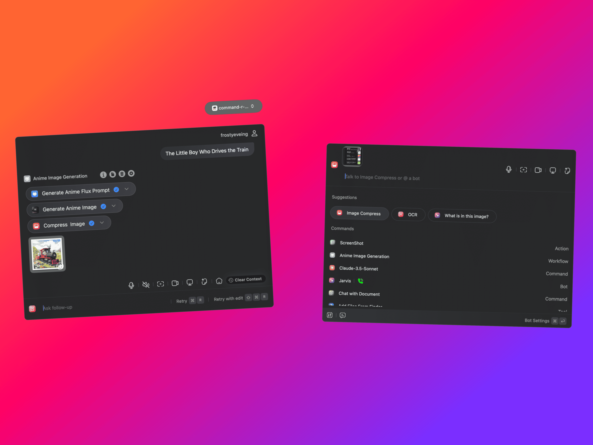

**1. Workflow**: A brand new Workflow feature that allows you to combine all plugins in EnConvo to create more powerful custom functionality.
> 1. Pre-built workflow: Anime Image Generation

**2. Context-Aware System**: Detects currently selected text, active browser tabs, and Finder-selected files

**3. All New Knowledge Base**: Completely rewritten knowledge base functionality for improved stability and speed (breaking changes - previously created knowledge bases will be deprecated)
> 1. Knowledge Base can now be linked to Bots
> 2. Added pre-configured EnConvo Help Assistant for common questions and usage guidance

**4. Voice Input Method**
> 1. Automatic line break functionality
> 2. Compatibility with Alfred and Raycast applications
> 3. Integration with AssemblyAI voice recognition service
> 4. Quick language switching settings for voice recognition

**5. Voice Input Method Push**
> 1. Support for press-and-hold shortcut activation (default: hold FN key) with automatic recognition upon release
> 2. Improved recognition speed for Groq Whisper and Local Whisper in Push mode

**6. Live Closed Captions**
> 1. System-wide automatic speech recognition for caption generation
> 2. Supports simultaneous interpretation, translating captions into your preferred language

**7. PopBar**
> 1. Enhanced styling with frosted glass effect for improved aesthetics
> 2. Added Exclude Apps feature to disable PopBar in specific applications
> 3. Fixed PopBar visibility issues in Yomu software
> 4. Improved CommandUI interaction in PopBar

**8. SmartBar**
> 1. Integrated AI Search functionality
> 2. Added Suggestions area for context-aware command and prompt recommendations
> 3. Rebuilt input field to handle large text volumes
> 4. Improved placeholder logic
> 5. Fixed English input issues with non-English input methods

**9. Dynamic Parameters**
> 1. Prompt support for dynamic parameters: selection_text, current_browser_tab, date, time, etc.

**10. Image Generation Plugin**
> 1. Added Flux and StableDiffusion image generation plugins
> 2. Integration with Together AI's image generation service
> 3. Added EnConvo Cloud Plan support for image generation services

**11. Shortcuts**
> 1. Added double-click shortcut support
> 2. Added comprehensive shortcut list view for unified management
> 3. Fixed non-functioning shortcut deletion bug

**12. Translation Plugin Improvements**
> 1. Added DeepL translation plugin with custom API key support
> 2. Added dedicated LLM Translator plugin
> 3. Added EnConvo Cloud Plan (DeepL) translation service

**13. New Plugins**
> 1. *Search News:* Dedicated news search plugin
> 2. *Search Github:* Specialized GitHub repository search
> 3. *OCR:* Direct text recognition from images
> 4. *Add Files From Finder:* Quick context addition from Finder
> 5. *Input Text Field:* User text input support for Workflow integration
> 6. *Voice Input Method Push:* Press-and-hold voice input functionality
> 7. *Live Closed Captions:* Real-time captioning & translation
> 8. *EnConvo Help Assistant:* EnConvo customer service
> 9. *Anime Image Generation:* Pre-built Workflow plugin for anime-style image generation and compression
> 10. *Http Request(Beta):* Network request capability for Workflow integration
> 11. *FLUX.1-dev:* Image generation powered by Flux.1-dev
> 12. *FLUX.1-schnell:* Image generation powered by Flux.1-schnell
> 13. *Stable Diffusion 3 Large:* Image generation powered by Stable Diffusion 3 Large
> 14. *Stable Diffusion 3 Medium:* Image generation powered by Stable Diffusion 3 Medium

**14. Other Optimizations and Bug Fixes**
> 1. Added API model list retrieval for Together.ai and Cloudflare AI
> 2. Performance optimizations
> 3. Reorganized settings page layout

## New updates of Enconvo V1.9.16 (2024-10-18)

1. Added Retry & Retry with edit functionality
2. Outlook app adaptation
3. Integration: https://sambanova.ai/
4. Integration: https://cerebras.ai
5. Add "Prompt Generator" plugin powered by OpenAI [prompt-generation](https://platform.openai.com/docs/guides/prompt-generation)
6. UI interface optimization
7. Other optimizations and bug fixes

## New updates of Enconvo V1.9.15 (2024-10-14)

1. Added **Voice Input Method**. You can now input text via voice in any software. You can also enable the translation plugin for voice input and translation, or enable the fixed spelling and grammar plugin for grammar and spelling correction. The default shortcut is Option + B.
2. Added Key Management. Unified management and configuration for all KEYs.
3. Optimized Fix Spelling & Grammar AI. When pasting replacements, you can now only replace the optimized text without pasting the explanation below.
4. Added shortcut for voice input function, default shortcut is Option + A.
5. Added Youdao translation engine.
6. Optimized Smart Bar. You can now directly modify the model or modify the model and/or voice configuration at the top of SmartBar.
7. Other optimizations and bug fixes.

## New updates of Enconvo V1.9.14 (2024-10-08)

1. Added Reset functionality for each Command, allowing individual reset of command settings to default
2. Option to reset PopBar configuration to default settings
3. Optimized audio playback pause functionality
4. Improved "Ask follow-up" logic
5. Password input fields now have toggle for showing/hiding password
6. Added compatibility with WhatsApp
7. Various other optimizations and bug fixes

## New updates of Enconvo V1.9.13(2024-10-04)

1. PopBar now opens in a separate mini window
2. Chat with document enhancement: faster and more stable
3. Chat Window performance optimization for increased speed
4. Compatibility with Adobe series software
5. Added **Spanish Teacher** Bot
6. Added **Latin Teacher** Bot
7. Numerous other optimizations and bug fixes

## New updates of Enconvo V1.9.12(2024-8-02)

1. **Markdown Reader:** All-new Markdown Reader engine with **LaTeX** support
2. **Optimizations & Bug fixes:** Some optimizations and bug fixes

## New updates of Enconvo V1.9.11(2024-05-20)

1. **Call Bot:** You can now make voice/video calls with Bot and share the contents of the screen to Bot in real time, support interruptions, and integrate multiple Speech-To-Text and Text-To-Speech engines
2. **Translate:** Enhance Translate function, support setting source and target languages
3. **PopBar:** Enhance PopBar function, more powerful
4. **Developer Tools:** Integrate Langchain Smith to trace LLM, etc
5. **Optimizations & Bug fixes:** And lots of other optimizations and bug fixes

### Enconvo 1.9.0 (2024-04-24)  

:::info What's New ?

 

- **Internet Browsing**: Add Internet Browsing **Providers**: `Azure Bing Search Engine, Google Cloud Search Engine, Tavily, Exa, You Search, SerpApi` , learn more : [Internet Browsing Providers](docs/features/internet-browsing)

- **Knowledge Base** : Create a knowledge base from **a whole website**, learn more : [Knowledge Base](docs/features/knowledge-base) 

- **Knowledge Base** : Now you can install a Knowledge Base Extension from the extension store.

- **TTS Providers** : Add new TTS Providers : `Edget TTS, System TTS, Microsoft Azure TTS, OpenAI TTS, ElevenLabs TTS `, learn more : [TTS Providers](docs/features/tts)

- **Link Read Aloud**: Read aloud the content of a link , just `@Link Read Aloud` 

- **Chat With Link**:  Chat With a Link , just `@Chat With Link`

- **Summarize Webpage**: Summarize the content of a webpage , just `@Summarize Webpage`   

- **Summarize Document**: Summarize the content of a Document , just `@Summarize Document`   

- **Save as Audio File**: Save Any text or Document as an audio file , just `@Save As Audio File`   

- **Link Reader Providers**:  Add Link Reader Providers : `JinaAI`,`Trafilatura`,`GPT API Link Reader`,`EnconvoAI` , for read content of a link.

- **LLM Providers**:  Add LLM Providers : `Cohere AI` .

- **Embedding Providers**:  Add Embedding Providers : `PremAI`,`Voyage AI`,`Cohere AI` .

:::

:::warning What's Improvements ?

 

- **Chat With Document**: Optimize interaction experience .

- **Internet Browsing**: Optimize interaction experience .

:::

